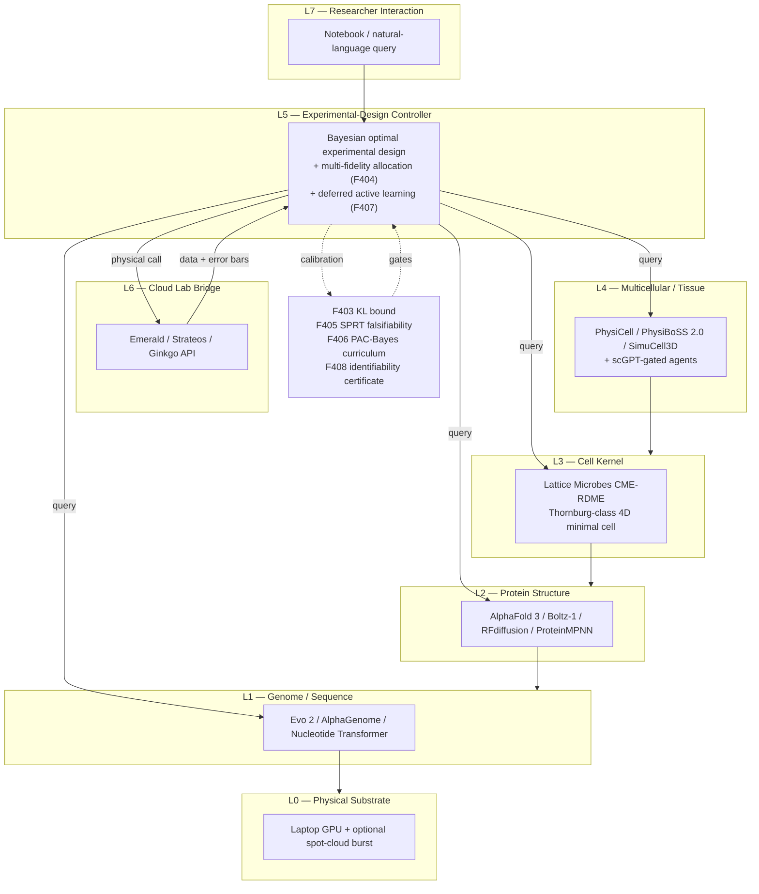
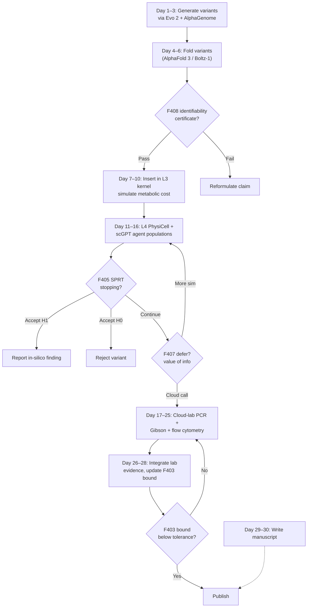

# Simulated Experiment Platform

---

## Abstract

Biology has entered a regime in which a single investigator, equipped only with a laptop and a modest compute budget, can prototype experiments across the full stack from nucleotide sequence to tissue-scale phenotype. The convergence of four technology layers makes this possible: first, fully dynamical four-dimensional whole-cell simulations of the genetically minimal bacterium JCVI-syn3A that resolve a complete 100-minute cell cycle with spatial and stochastic fidelity (Thornburg et al., *Cell*, 2026); second, single-cell transcriptomic foundation models trained on tens of millions of cells that predict perturbation responses zero-shot (Cui et al., 2024; Theodoris et al., 2023); third, all-atom structure-prediction systems that extend AlphaFold to nucleic acids, ligands, and full biomolecular complexes (Abramson et al., 2024); and fourth, genome-scale generative models that propose de novo regulatory sequences and pathogen-resistant cell types (Brixi et al., 2025). Despite these advances, the central unresolved obstacle is the sim-to-real calibration gap: the chain of abstractions from bacterium to human primary cell is long, each foundation model is trained predominantly on mouse data, and no framework yet quantifies end-to-end bias or provides a principled allocation of scarce lab dollars against abundant compute hours. We present IN-SILICO-AXIS (ISA), a seven-layer architecture that unifies a Thornburg-class kinetic cell kernel, agent-based tissue simulation, sequence/structure/cell foundation models, and a thin cloud lab application programming interface (API) under a calibration and identifiability backbone. We contribute mathematical frameworks that together define: a multi-scale sim-to-real Kullback-Leibler divergence bound, a convex Pareto allocation of compute-versus-dollar budgets across heterogeneous simulators and real assays, a sequential-probability-ratio falsifiability test tuned to heteroscedastic simulator noise, a PAC-Bayes curriculum for transferring minimal-cell mechanism to human primary cells, a deferred cloud-call active-learning rule with explicit value-of-information, and a structural-identifiability certificate that licenses a virtual-cell claim before any physical measurement is purchased. We illustrate the platform with five use cases — induced pluripotent stem cell (iPSC) reprogramming, partial-reprogramming rejuvenation, gene regulatory network (GRN) perturbation, base-editor screening, and intracellular signaling pathway design — and conclude with a concrete 30-day home-laboratory protocol. The central contribution is not a new simulator but a unifying calibration grammar that makes laptop-scale biology publishable and auditable.

---

## §1 Introduction

A decade ago, a biology laboratory required glassware, animals, and a budget in the millions; today, the highest-resolution physical model of any entire cell is a publicly downloadable simulation that runs on a workstation graphics processing unit (Thornburg et al., 2026). The intervening period produced four independent revolutions that, considered together, redefine what a solo investigator can attempt from a home office. First, the mechanistic whole-cell modeling line that began with the 525-gene *Mycoplasma genitalium* model (Karr et al., 2012) matured, through Lattice Microbes (Roberts et al., 2013; Earnest et al., 2018) and stochastic 3D simulations of JCVI-syn3A (Thornburg et al., 2022), into a four-dimensional dynamical model that resolves a complete cell cycle including lipid-driven growth, SMC-topoisomerase-controlled replication, and morphological division (Thornburg et al., 2026). Second, single-cell transcriptomics foundation models — scGPT (Cui et al., 2024), Geneformer (Theodoris et al., 2023), and scFoundation (Hao et al., 2024) — have shown that a transformer pretrained on tens of millions of cells can predict gene-perturbation responses, annotate cell types zero-shot, and infer context-specific gene networks. Third, de novo structure prediction, which briefly seemed complete at AlphaFold 2, has extended to nucleic acids, small molecules, and post-translational modifications (Abramson et al., 2024), and has been paired with generative protein design (Watson et al., 2023; Dauparas et al., 2022) to produce de novo binders, enzymes, and regulators in closed loops. Fourth, genome foundation models, beginning with Nucleotide Transformer (Dalla-Torre et al., 2025) and extending to Evo 2 (Brixi et al., 2025), now generate and evaluate sequence variants across all domains of life at the scale of entire chromosomes.

The practical consequence is that many experiments that previously required a bench can be prototyped, and in favorable cases concluded, without leaving the operating system. A single researcher can read a paper on a transcription factor, fetch the cognate protein and genomic sequence, simulate the mutant and wild-type structures and their DNA binding, insert the genetic circuit into a simulated minimal cell to check metabolic cost, use a single-cell foundation model to predict the transcriptomic response of a primary human cell type, and finally, if required, dispatch a narrow lab request to an automated laboratory (King et al., 2009; Steiner et al., 2019). The bottleneck is no longer compute or data availability, but methodological: there is no published framework that tells the investigator how much to trust any single layer of this cascade, how to allocate finite dollars to confirm the most load-bearing claims, or when to stop simulating and pay for a physical measurement.

This manuscript addresses that gap. We describe a seven-layer platform that we term IN-SILICO-AXIS (ISA) and introduce mathematical frameworks that provide the calibration, allocation, falsifiability, curriculum, deferred-decision, and identifiability backbone the stack has been missing. Our framing is deliberate: we treat the sim-to-real calibration gap as the primary obstacle, the specialized-assay lab bottleneck as a secondary resource-allocation problem, and identifiability and falsifiability as the gating criterion for whether a virtual-cell claim is publishable at all.

**Scope.** ISA is designed for investigators. It is not a claim that lab biology can be eliminated; it is a claim that the ratio of simulation hours to bench hours can be inverted, so that lab actions are reserved for the narrow set of questions that are both identifiable in principle and decisive in practice.

---

## §2 The 2026 State of Simulated Biology

### §2.1 Whole-cell mechanistic models

Whole-cell kinetic modeling began with the 2012 *Mycoplasma genitalium* model, which combined 28 submodels of biochemical and regulatory processes and predicted genome-wide gene essentiality at previously unreachable resolution (Karr et al., 2012). The Covert laboratory subsequently demonstrated that whole-cell models can be used for in silico genome minimization and design (Rees-Garbutt et al., 2020). The minimal-cell simulation line extends this paradigm to JCVI-syn3A, a synthetic bacterium with 493 essential genes (Breuer et al., 2019). Thornburg et al. (2022) presented a fully dynamical kinetic model of JCVI-syn3A that reproduced cell-cycle-scale behaviors including mRNA half-life distributions, DNA replication dynamics, and doubling behavior. The 2026 update extends this to four dimensions: it integrates lipid-driven membrane growth with experimental cryo-electron-tomography geometry, uses Helfrich membrane elasticity to model morphological transformation, and uses Brownian dynamics on an ensemble of DNA conformations to track replication and segregation under stochastic partition to daughter cells (Thornburg et al., 2026). The implementation uses Lattice Microbes, a reaction-diffusion and chemical-master-equation engine that scales to whole-cell simulations on consumer graphics hardware (Roberts et al., 2013; Earnest et al., 2018). Practically, a full 100-minute cell cycle simulation runs in several wall-clock hours on a single GPU, with each replicate producing a unique stochastic cell.

### §2.2 Agent-based multicellular and tissue simulators

Whole-cell mechanism does not scale naively to tissues; population-level behavior is handled by agent-based frameworks. PhysiCell is an open-source three-dimensional multicellular simulator that couples cell phenotype to multiple diffusing substrates through a biotransport solver (Ghaffarizadeh et al., 2017). Its hybrid agent-plus-pathway extension, PhysiBoSS 2.0, embeds stochastic Boolean intracellular signaling inside each cell agent using the MaBoSS engine, allowing signaling-network states to feed back into agent phenotype (Ponce-de-León et al., 2022). A practitioner-oriented graphical workflow is now available through PhysiCell Studio, enabling investigators without deep C++ expertise to define, run, and interactively explore multi-agent simulations (Heiland et al., 2024). Recent extensions include PhysiPKPD for pharmacokinetic-pharmacodynamic coupling (Bergman et al., 2022), PhysiMeSS for extracellular matrix fiber modeling (Noël et al., 2023), and an interactive Start & Stop add-on that allows parameters to be adjusted mid-simulation, bringing in-silico experiments closer to adaptive in-vitro protocols (Smeriglio et al., 2025). Practitioner-oriented workflow guides now cover the full multiscale modeling pipeline with reproducible tutorials (Ruscone et al., 2024). An independent three-dimensional tissue simulator, SimuCell3D, resolves subcellular-scale polarization, fluid cavities, and non-uniform mechanics, and is particularly well suited for epithelia imported from microscopy data (Runser et al., 2024). A companion workflow, PhysiCell-EMEWS, pairs the simulator with an extreme-scale model-exploration platform to perform high-throughput parameter sweeps for hypothesis testing (Ozik et al., 2018). A recent community benchmarking initiative comparing PhysiCell, BioDynaMo, Chaste, TiSim, and CompuTiX has begun to establish interoperability standards (Metzcar et al., 2019), and a 2026 systematic review of in-silico organoid models catalogues thirty-two peer-reviewed platforms covering intestinal, neural, pancreatic, kidney, and tumor organoids (Neagu et al., 2026).

### §2.3 Intracellular signaling, gene-regulatory, and systems-biology simulators

Classical systems biology provides a third simulator class. COPASI is a widely used ODE/stochastic simulator for biochemical reaction networks, including metabolic control analysis and parameter estimation (Hoops et al., 2006). BioModels maintains a curated repository of reproducible systems-biology models and has grown to include thousands of peer-reviewed models suitable for composition and extension (Chelliah et al., 2015). Virtual Cell (VCell) provides a spatial stochastic and deterministic PDE simulator with native support for biochemical networks in realistic cellular geometry (Cowan et al., 2012). These classical tools remain load-bearing for signal-transduction use cases such as MAPK, Wnt, and Hippo (YAP/TAZ) pathway analysis.

### §2.4 Single-cell foundation models

Foundation models have redefined transcriptomics. scGPT, pretrained on over 33 million cells, supports fine-tuning for perturbation response prediction, multi-omic integration, and gene network inference (Cui et al., 2024). Geneformer, a context-aware transformer trained on approximately 30 million human single-cell transcriptomes, encodes gene networks as ranked-expression sequences and transfers to disease-specific prediction tasks (Theodoris et al., 2023). scFoundation scales foundation-model training to whole-transcriptome continuous values rather than binned expression (Hao et al., 2024). Critical recent scrutiny shows that these models can underperform simple linear baselines on out-of-distribution perturbation prediction (Ahlmann-Eltze et al., 2025) and exhibit unstable zero-shot behavior on unseen cell types (Kedzierska et al., 2025). Benchmarks such as the CausalBench challenge (Chevalley et al., 2025) now provide standardized evaluation suites. Design-focused virtual-cell systems — including Arc Institute's *State*, whose design philosophy we adopt as narrative inspiration — propose that perturbation context should be encoded as an explicit conditioning signal rather than implicit in the training distribution (Adduri et al., 2025).

### §2.5 Structure and sequence foundation models

All-atom structure prediction now covers proteins, nucleic acids, small-molecule ligands, and post-translational modifications with accuracy approaching experimental resolution for most complex classes (Abramson et al., 2024). Complementary tools include Boltz-1, which democratizes biomolecular complex prediction on commodity hardware (Wohlwend et al., 2024), and ABCFold, which permits unified running and comparison of AlphaFold 3, Boltz-1, and Chai-1 for robust ensemble predictions (Elliott et al., 2025). De novo structural design is available through RFdiffusion, a denoising-diffusion generative model for protein backbones (Watson et al., 2023), paired with ProteinMPNN for sequence design on a specified structure (Dauparas et al., 2022), which has produced atomically accurate de novo antibodies (Bennett et al., 2026) and atom-context-conditioned designs via LigandMPNN (Dauparas et al., 2025). At the nucleotide level, Nucleotide Transformer provides robust foundation models for human genomics (Dalla-Torre et al., 2025), and Evo 2 extends this to genome modeling and design across all domains of life with a model capable of zero-shot pathogenicity prediction and generative chromosome design (Brixi et al., 2025).

### §2.6 Cloud laboratories as a thin physical interface

Automated laboratories now provide remote, queue-based access to standardized lab unit operations. Platforms such as Emerald Cloud Lab, Strateos, and Ginkgo Bioworks make it possible to submit PCR, transfection, sequencing, and small-molecule-handling protocols via application programming interfaces and receive both raw data and computed summaries in return. These services are not a replacement for a specialized  lab — cryo-electron microscopy, patch-clamp electrophysiology, and multi-electrode array recording remain unavailable as commoditized cloud services — but they transform a subset of molecular biology into a callable function. The robot-scientist lineage, beginning with Adam and Eve (King et al., 2009), has matured into production-grade automation (Steiner et al., 2019) that closes the loop between hypothesis generation and physical test, and recent virtual-organoid platforms explicitly formalize the handoff between in-silico and in-vitro phases of a study (Bai et al., 2025).

---

## §3 The Architecture

We decompose the home-laboratory stack into seven layers, each with a defined input interface, a defined output interface, and a calibration contract that specifies how the layer's outputs are bounded and bias-corrected. The architecture is summarized in Figure 1.



**Figure 1.** Seven-layer IN-SILICO-AXIS architecture. Arrows denote information flow. The calibration block on the right gates which outputs from any layer are permitted to leave that layer without a cloud-lab confirmation.

### §3.1 L0 — Physical substrate

The bottom layer is an ordinary laptop with a consumer graphics card (≥12 GB VRAM recommended for AlphaFold 3 at typical length scales) and optional burst access to spot-priced cloud GPUs for peak workloads. The calibration contract for L0 is trivial: numeric precision is auditable and reproducible given fixed random seeds.

### §3.2 L1 — Genome and sequence layer

L1 uses Evo 2 for variant effect prediction and generative sequence design across scales from a single nucleotide to a complete chromosome (Brixi et al., 2025). Nucleotide Transformer supplies compact embeddings for downstream classifiers and pathogenicity scoring (Dalla-Torre et al., 2025). The output is a distribution over sequences plus per-base epigenomic tracks; the calibration contract is zero-shot benchmark performance on held-out variant-effect datasets, including ClinVar pathogenicity, saturation mutagenesis assays, and GWAS fine-mapping.

### §3.3 L2 — Protein structure layer

L2 converts sequence to three-dimensional structure and, for designed regulators, performs the inverse mapping. AlphaFold 3 and Boltz-1 provide structure prediction with ligand and nucleic-acid support (Abramson et al., 2024; Wohlwend et al., 2024). RFdiffusion generates de novo backbones targeting a specified function (Watson et al., 2023), ProteinMPNN and LigandMPNN produce sequences compatible with a backbone (Dauparas et al., 2022; Dauparas et al., 2025), and Bennett et al. (2026) demonstrate that the pipeline is sufficient for atomically accurate antibody design. The calibration contract for L2 is root-mean-square deviation against crystallographic ground truth on held-out Protein Data Bank structures.

### §3.4 L3 — Cell kernel

L3 is the mechanistic whole-cell simulator. We adopt Thornburg-class four-dimensional JCVI-syn3A simulations as the anchor because they alone resolve a full cell cycle with spatial and stochastic fidelity (Thornburg et al., 2026), using Lattice Microbes as the numerical engine (Roberts et al., 2013). For human-cell use cases we supplement the bacterial kernel with an expandable pathway library imported from BioModels (Chelliah et al., 2015) and simulated in COPASI (Hoops et al., 2006) or Virtual Cell (Cowan et al., 2012). The calibration contract is doubling time, mRNA half-life distribution, energy balance, and single-cell heterogeneity statistics against the experimental benchmarks Thornburg et al. (2026) provide for the bacterium, and against Replogle et al. (2022) genome-scale Perturb-seq for the human case.

### §3.5 L4 — Multicellular and tissue layer

L4 scales from single cell to populations with spatial geometry. PhysiCell and PhysiBoSS 2.0 handle cell-cycle, mechanics, and intracellular Boolean signaling (Ghaffarizadeh et al., 2017; Ponce-de-León et al., 2022); SimuCell3D handles epithelial morphology with subcellular resolution (Runser et al., 2024). Agent phenotypes may be gated by scGPT or Geneformer inference at each time step, allowing each agent to be a transcriptomically informed instance rather than a fixed-type Boolean node. The calibration contract is the Perturb-seq ground truth (Adamson et al., 2016; Replogle et al., 2022) for the transcriptomic component and microscopy-derived geometry for the spatial component.

### §3.6 L5 — Experimental-design controller

L5 is the decision-making core. It implements Bayesian optimal experimental design (Kusne et al., 2020) with a multi-fidelity extension (F404) and a deferral rule (F407) that decides whether the next informative action is a simulation call, a foundation-model inference, or a physical cloud-lab call. L5 also enforces the structural-identifiability gate (F408) that blocks a claim from leaving the simulator stack without a certificate, and the sequential-probability-ratio test (F405) that decides when a simulated result has accumulated enough evidence to be reported.

### §3.7 L6 — Cloud lab bridge

L6 is a thin REST-style API that exposes a small set of unit operations: PCR, Gibson assembly, transfection of a curated set of cell lines, flow cytometry, short-read sequencing, and small-molecule handling (King et al., 2009; Steiner et al., 2019). Access is modeled as a fee-for-service queue with variable latency and cost. The calibration contract is measurement repeatability across technical replicates within a single vendor, and systematic-bias correction across vendors when multiple providers are used.

### §3.8 L7 — Researcher interaction

L7 is a notebook interface coupled to a natural-language task-specification layer. The researcher states an intent — "verify whether variant X of FOXA1 retains pioneer activity on a physiological nucleosome" — and L7 dispatches the task to the identified combination of lower layers, returning both a prediction and an auditable trace including identifiability certificate and falsifiability test outcome.

---

## §4 Mathematical Frameworks

We introduce frameworks that collectively provide the calibration, allocation, and falsifiability backbone of ISA. Each is designed to be implementable on a laptop and interpretable by a reviewer; each is distinct from the F1–F402 catalog of our prior work.

### §4.1 F403 — Multi-Scale Sim-to-Real Kullback–Leibler Divergence Bound

Let the ISA cascade consist of $L$ layers indexed $\ell \in \{0, 1, \dots, L-1\}$, each mapping an input random variable $X_\ell$ to an output $X_{\ell+1}$ via a layer operator $T_\ell: X_\ell \mapsto X_{\ell+1}$. Let $\mathbb{P}_\ell$ denote the distribution produced by ISA at layer $\ell$, and $\mathbb{Q}_\ell$ the (unknown) ground-truth distribution for the real biological system at the same layer. We wish to bound the end-to-end information loss $D_{\mathrm{KL}}(\mathbb{P}_L \,\Vert\, \mathbb{Q}_L)$ as a function of per-layer miscalibration.

**Assumption.** Each layer operator $T_\ell$ is $L_\ell$-Lipschitz in Hellinger distance, i.e., $H(T_\ell \mathbb{P} \,\Vert\, T_\ell \mathbb{Q}) \leq L_\ell \cdot H(\mathbb{P} \,\Vert\, \mathbb{Q})$ for all admissible $\mathbb{P}, \mathbb{Q}$.

**Claim.** Let 
```math
\delta_\ell := H(\mathbb{P}_\ell \,\Vert\, \mathbb{Q}_\ell)
```
. Then

```math
D_{\mathrm{KL}}(\mathbb{P}_L \,\Vert\, \mathbb{Q}_L) \;\leq\; 2 \left( \sum_{\ell=0}^{L-1} \delta_\ell \prod_{k=\ell+1}^{L-1} L_k \right)^{\!2}.
```

**Proof sketch.** By the Hellinger triangle inequality and Lipschitz continuity, total Hellinger divergence at the output accumulates as the weighted telescoping sum $\delta_{\mathrm{tot}} = \sum_\ell \delta_\ell \prod_{k > \ell} L_k$. The bound $D_{\mathrm{KL}} \leq 2 H^2$ for small Hellinger distances, valid whenever both measures are mutually absolutely continuous, then yields the claim.

**Variables.** 
```math
\mathbb{P}_\ell, \mathbb{Q}_\ell
```
: simulator and real-world distribution at layer $\ell$; $L_\ell$: layer Lipschitz constant, estimable from paired simulator-vs-lab calibration data (Perturb-seq ground truth for L4, doubling time for L3, ClinVar for L1); $\delta_\ell$: empirical per-layer Hellinger miscalibration; $H$: Hellinger distance; $D_{\mathrm{KL}}$: Kullback–Leibler divergence.

**Utility.** F403 tells the investigator how many dollars of cloud-lab measurement must be spent to drive $D_{\mathrm{KL}}$ below a tolerance required for a given downstream decision. If any single layer's $\delta_\ell$ is poorly estimated, its Lipschitz multiplier makes its uncertainty dominate. F403 identifies which layer to re-calibrate first.

**Distinctness.** F403 is not a Wasserstein-2 contraction of a single Gaussian process posterior (F395); it is an end-to-end information-theoretic upper bound on cascade miscalibration under layer-wise Lipschitz assumptions.

### §4.2 F404 — Convex Pareto Allocation Across Heterogeneous Simulators and Real Assays

Let the investigator hold a compute budget $C$ (GPU-hours) and a dollar budget $D$ for cloud-lab calls, and let the per-layer cost-fidelity relationship be $\phi_\ell(c_\ell)$, where $c_\ell$ is compute or dollars allocated to layer $\ell$, and $\phi_\ell$ is the resulting precision (inverse posterior variance) of the layer's output. We assume $\phi_\ell$ is concave and monotonically increasing — a universal property of ensemble averaging, finite-sample posterior concentration, and independent replication.

**Problem.** Minimize the end-to-end posterior variance of the decision statistic subject to the two budgets. With $w_\ell$ the sensitivity of the decision statistic to the output of layer $\ell$ (computable by automatic differentiation through the composition), the optimization is

```math
\min_{c, d} \;\; \sum_{\ell=0}^{L-1} \frac{w_\ell^2}{\phi_\ell(c_\ell) + \psi_\ell(d_\ell)} \quad \text{subject to} \quad \sum_\ell c_\ell \leq C, \; \sum_\ell d_\ell \leq D, \; c_\ell, d_\ell \geq 0,
```

where $\psi_\ell$ is the dollar-driven precision contribution at layer $\ell$ (zero except at $\ell = L_\text{cloud}$ for a pure cloud-lab layer).

**Claim.** The Karush–Kuhn–Tucker conditions yield a water-filling allocation: each layer receives resources until its marginal precision-per-cost equals a Lagrange multiplier common across layers, producing a Pareto-optimal frontier between compute and dollars.

**Variables.** $w_\ell$: decision sensitivity; $\phi_\ell, \psi_\ell$: concave cost-fidelity maps estimated from small pilot runs; $C, D$: compute and dollar budgets; the Lagrange multipliers $(\lambda_C, \lambda_D)$ are interpretable as shadow prices of compute and dollars.

**Distinctness.** F404 allocates across heterogeneous simulators and real experiments simultaneously; Gaussian-process regret allocates only within a single acquisition loop on a single surrogate.

### §4.3 F405 — Sequential Probability Ratio Test for Heteroscedastic Simulator Claims

Let the null hypothesis $\mathcal{H}_0$ state that a simulator-derived effect size is zero, and let $\mathcal{H}_1$ state that it equals a prespecified $\mu_1 > 0$. At each simulation replicate $n = 1, 2, \dots$ the investigator observes a noisy estimate $Y_n$ with layer-specific variance $\sigma_n^2$ that depends on the particular mixture of layers invoked. The Wald sequential probability ratio test statistic is

```math
\Lambda_n \;=\; \sum_{i=1}^{n} \log \frac{f_1(Y_i; \sigma_i^2)}{f_0(Y_i; \sigma_i^2)} \;=\; \sum_{i=1}^{n} \frac{\mu_1}{\sigma_i^2}\left(Y_i - \frac{\mu_1}{2}\right),
```

with stopping rule: accept $\mathcal{H}_1$ if $\Lambda_n \geq \log((1-\beta)/\alpha)$, accept $\mathcal{H}_0$ if $\Lambda_n \leq \log(\beta/(1-\alpha))$, continue otherwise.

**Claim.** For target false-positive rate $\alpha$ and false-negative rate $\beta$, the expected number of replicates under $\mathcal{H}_1$ is

```math
\mathbb{E}_{\mathcal{H}_1}[N] \;\approx\; \frac{2}{\mu_1^2} \left( (1-\beta) \log \frac{1-\beta}{\alpha} + \beta \log \frac{\beta}{1-\alpha} \right) \cdot \bar{\sigma}^2,
```

where $\bar\sigma^2$ is a weighted harmonic mean of the per-replicate layer-specific variances.

**Variables.** $Y_n$: per-replicate estimator; $\sigma_n^2$: replicate-specific variance (heteroscedastic because different layer mixes produce different variances); $\alpha, \beta$: error rates; $\mu_1$: minimum detectable effect size.

**Distinctness.** F405 is a sequential falsifiability rule that adapts the classical Wald test to per-replicate heteroscedasticity arising from layer-mix variability; F396 (per-round falsifiability power) is a fixed-sample-size power computation.

### §4.4 F406 — PAC-Bayes Curriculum for Minimal-Cell-to-Human Transfer

Let $\mathcal{P}_\theta$ denote the family of simulator distributions parameterized by $\theta$, and let the investigator learn $\theta$ from a curriculum of datasets indexed by $t = 1, \dots, T$: bacterial whole-cell data ($t = 1$), simple-eukaryote data ($t = 2, \dots$), and human primary-cell data ($t = T$). Let $\pi_t$ be the prior at stage $t$ and $\hat\theta_t$ the learned parameter. By PAC-Bayes (with McAllester-style bound), the generalization error at stage $T$ obeys, with probability at least $1 - \eta$,

```math
\mathcal{R}_T(\hat\theta_T) \;\leq\; \hat{\mathcal{R}}_T(\hat\theta_T) \;+\; \sqrt{\frac{D_{\mathrm{KL}}(\hat\theta_T \,\Vert\, \pi_T) + \log(2 N_T / \eta)}{2 N_T - 1}},
```

where $N_T$ is the sample size at stage $T$.

**Curriculum rule.** Choose priors $\pi_t$ sequentially so that $\pi_t$ is the posterior from stage $t-1$ tempered by a human-specific regularizer. Then the KL term is small whenever prior stages transfer mechanistic structure rather than superficial feature statistics.

**Variables.** $\mathcal{R}_T, \hat{\mathcal{R}}_T$: true and empirical risks at final stage $T$; $\pi_T$: curriculum-driven prior at stage $T$; $N_T$: number of human primary-cell examples; $\eta$: bound confidence.

**Utility.** F406 quantifies the value of bacterial-to-human mechanistic transfer, and shows that the generalization gap shrinks at rate $N_T^{-1/2}$ provided the KL term is controlled.

**Distinctness.** No prior F-framework has given a PAC-Bayes generalization bound tailored to the minimal-cell-to-human transfer-learning problem.

### §4.5 F407 — Deferred Cloud-Call Active-Learning Rule

Consider a sequential decision process in which, at each step, the investigator chooses among: (i) a laptop simulation of marginal cost $c_\text{sim}$ and expected information gain $\mathbb{E}[\Delta I_\text{sim}]$; (ii) a foundation-model inference of cost $c_\text{fm}$ and gain $\mathbb{E}[\Delta I_\text{fm}]$; (iii) a cloud-lab physical call of cost $c_\text{cloud}$ and gain $\mathbb{E}[\Delta I_\text{cloud}]$. Let $\delta \in (0, 1)$ be a time-discount factor (experiments that take longer to return are less valuable because time-to-decision compounds). The Bellman equation for the optimal policy is

```math
V(s) \;=\; \max_{a \in \{\text{sim}, \text{fm}, \text{cloud}\}} \Big\{ \mathbb{E}[\Delta I_a | s] - c_a + \delta^{\tau_a} \cdot \mathbb{E}[V(s') | s, a] \Big\},
```

where $\tau_a$ is the wall-clock time of action $a$, $s$ is the current posterior over the decision statistic, and $s'$ is the successor posterior.

**Claim.** The optimal policy defers to the cloud call only when the instantaneous expected value of information $\mathbb{E}[\Delta I_\text{cloud} | s] - c_\text{cloud} - (\mathbb{E}[\Delta I_\text{sim} | s] - c_\text{sim})$ exceeds the discount-adjusted option value of further simulation. This is a classical optimal-stopping problem whose solution admits a threshold rule: cloud-lab the decision when posterior uncertainty exceeds an explicit-form boundary.

**Variables.** $s$: current Bayesian posterior; $c_a, \tau_a$: cost and latency of action $a$; $\delta$: time-discount factor.

**Distinctness.** F407 extends classical acquisition-function stopping by explicitly modeling heterogeneous-cost heterogeneous-latency actions, whereas prior GP-regret frameworks assume homogeneous action costs.

### §4.6 F408 — Structural-Identifiability Certificate for Virtual-Cell Claims

A simulator claim is useful only if the parameter it asserts is identifiable from the simulator's outputs. Let the simulator kernel be an ODE system $\dot{x} = f(x, u; \theta)$, $y = h(x; \theta)$, with state $x$, input $u$, output $y$, and parameters $\theta$. Structural identifiability asks whether $\theta$ is uniquely determined by the input-output map (Bellu et al., 2007; DiStefano, 2014).

**Certificate.** We compute the rank of the Jacobian of the extended observability map,

```math
\mathcal{O}(x_0, \theta) \;=\; \begin{bmatrix} h(x_0;\theta) \\ \mathcal{L}_f h(x_0;\theta) \\ \vdots \\ \mathcal{L}_f^{n-1} h(x_0;\theta) \end{bmatrix},
```

where $\mathcal{L}_f$ denotes the Lie derivative along the drift $f$, evaluated symbolically using the DAISY algorithm on the parameter-extended dynamics. Rank deficiency at $\theta_0$ certifies that $\theta$ is not structurally identifiable at $\theta_0$, and any simulator claim about this parameter must either be revised to a function of structurally identifiable quantities or escalated to a cloud-lab call.

**Variables.** $f, h$: kernel drift and observation; $\theta$: parameters under claim; $\mathcal{L}_f^k$: $k$-fold Lie derivative; $\mathcal{O}$: extended observability matrix.

**Utility.** F408 gates the manuscript-writing step: a claim whose parameter is not identifiable in the simulator is either impermissible as stated or must be converted into a claim about an identifiable functional of the parameter.

**Distinctness.** No prior F-framework has formalized structural identifiability as a publication gate; the closest prior work (F369 portfolio value; F383 delivery-chromatin coupling) addresses value or mechanism, not identifiability.

---

## §5 Use Cases

### §5.1 iPSC reprogramming

Induced pluripotency — the conversion of somatic cells to an embryonic-like pluripotent state by ectopic expression of a defined transcription-factor cocktail (Takahashi and Yamanaka, 2006) — is the canonical test of a reprogramming platform. ISA allows the investigator to propose a variant Yamanaka-like cocktail in L1 (Evo 2 suggests sequence variants; AlphaGenome scores their regulatory effect), fold the variants in L2 (AlphaFold 3 predicts the structure of the modified factor), insert the circuit into L3 (the kinetic cost of expression is simulated), and predict the transcriptomic state of the reprogramming population in L4 (scGPT performs zero-shot projection to a reference human atlas). F403 bounds the end-to-end divergence from real primary-fibroblast-derived iPSC data; F408 certifies which kinetic parameters of the reprogramming cascade are identifiable from the simulation alone. The investigator issues a cloud call only for the decisive colony-formation confirmation. A decade of iPSC clinical translation has established the real-world benchmarks against which these simulations must calibrate (Shi et al., 2017).

### §5.2 In-vitro aging reversal and partial reprogramming

Partial reprogramming — pulsed, non-terminal expression of Yamanaka factors — has been shown to reset epigenetic-age clocks in multiple tissues without loss of cell identity (Ocampo et al., 2016). ISA supports an in-silico partial-reprogramming use case in which L3 models the dose-response curve of OSKM induction and L4 projects epigenetic-clock predictions via foundation-model inference against reference atlases. F405 provides the stopping rule for concluding that a given OSKM pulse schedule resets the clock at a target effect size with specified power, and F408 ensures that claims about the underlying rejuvenation mechanism are restricted to identifiable functionals.

### §5.3 GRN perturbation experiments

Perturb-seq at genome scale has mapped gene-regulatory relationships in K562 cells and demonstrated that sparse linear baselines often outperform foundation-model predictions on held-out perturbations (Replogle et al., 2022; Ahlmann-Eltze et al., 2025). Cell-type-specific CRISPRa screens for regulatory element discovery extend this paradigm to hPSC-derived neurons and other primary-derived systems (Chardon et al., 2024). ISA provides an in-silico Perturb-seq loop in which L5 proposes the next most-informative perturbation via F407's deferred active-learning rule; the chosen perturbation is first simulated at L4 using scGPT-gated PhysiCell agents, and a cloud-lab call is issued only when the simulator's uncertainty exceeds the SPRT stopping threshold (F405). Transfer-learning frameworks for GRN construction, such as CellPolaris, further support the master-TF identification step that precedes each proposed perturbation (Feng et al., 2026). Benchmarks such as CausalBench provide held-out evaluation suites (Chevalley et al., 2025).

### §5.4 Base- and prime-editor screening

ISA's base-editor use case uses L1 (Evo 2) to predict pathogenicity of single-nucleotide variants, L2 to fold the resulting proteins, and L3 to predict the metabolic cost of expression. The fitness landscape thus obtained is a surrogate for in-vivo outcomes against which only a narrow slice of variants is carried forward for cloud-lab screening. Genome-scale Perturb-seq provides the calibration data for the L4 transcriptomic prediction (Replogle et al., 2022).

### §5.5 Intracellular signaling and pathway design

Classical signal-transduction pathways — MAPK, Wnt, Hippo/YAP-TAZ — are represented in BioModels and simulated in COPASI or Virtual Cell (Chelliah et al., 2015; Hoops et al., 2006; Cowan et al., 2012). ISA composes these models with L3's kinetic cell kernel to answer questions about the crosstalk between a designed genetic circuit and endogenous signaling. F406's PAC-Bayes curriculum transfers bacterial signaling-motif benchmarks to human primary cells, and F408's identifiability certificate restricts claims to parameters observable from the imported model.

---

## §6 A 30-Day Home-Laboratory Protocol

We specify a concrete 30-day schedule that a single investigator can execute from a home office, operating ISA against a target of validating a novel transcription-factor variant for reprogramming. The schedule is structured as a series of decision gates; at each gate, F405's SPRT test and F408's identifiability certificate determine whether the investigator proceeds to the next layer or escalates to a cloud-lab call. The decision structure is illustrated in Figure 2.



**Figure 2.** Decision tree for a 30-day home-laboratory protocol implementing ISA around a reprogramming-variant validation question. Each gate corresponds to an F-framework rule from §4.

**Days 1–3.** Generate a diverse pool of TF variants using Evo 2 (Brixi et al., 2025). Score each with Nucleotide Transformer for sequence-level pathogenicity and with genome-scale language-model embeddings (Dalla-Torre et al., 2025). Retain top $N$ = 100–1000 variants.

**Days 4–6.** Fold the variants in AlphaFold 3 (Abramson et al., 2024) and compare against Boltz-1 (Wohlwend et al., 2024) using ABCFold (Elliott et al., 2025) to assess structural confidence. Variants failing the F408 identifiability certificate — because the biologically relevant parameter is not observable in the simulator — are reformulated or dropped.

**Days 7–10.** Insert the variant into the L3 Thornburg-class kinetic cell kernel (Thornburg et al., 2026). Simulate expression over a full cell cycle; check that the added metabolic and translational burden does not violate the growth constraint.

**Days 11–16.** Run PhysiCell + PhysiBoSS 2.0 with scGPT-gated agent populations (Ghaffarizadeh et al., 2017; Ponce-de-León et al., 2022; Cui et al., 2024). At each simulated day, evaluate the F405 SPRT stopping rule for the decision statistic of interest. If the rule continues, evaluate F407's deferral policy: further simulation or a cloud-lab call.

**Days 17–25.** If the protocol has triggered a cloud call, submit the physical protocol to an automated laboratory such as Emerald Cloud Lab, Strateos, or Ginkgo Bioworks, following the handoff paradigm formalized for virtual-organoid platforms (Bai et al., 2025). Typical cloud-lab assays — PCR, Gibson assembly, transient transfection, flow cytometry — complete within one week including queue time. Raw data are returned in machine-readable form.

**Days 26–28.** Integrate the cloud-lab evidence into the posterior and recompute the F403 end-to-end KL bound. If the bound is below the tolerance defined by the publication target, proceed; otherwise, iterate.

**Days 29–30.** Write the manuscript, including the identifiability certificate, the SPRT audit trail, and the F403 bound as machine-generated supplementary materials.

---

## §7 Calibration, Validation, and Open Questions

### §7.1 Calibration benchmarks

ISA's core empirical promise is that F403's $\delta_\ell$ values can be estimated from a small set of standardized benchmarks. For L1 and L2, variant effect and structure-prediction benchmarks are well established in literature. For L3, the Thornburg 2026 4D simulations reproduce 100-minute cell-cycle properties, membrane growth kinetics, and mRNA half-life distributions with measured accuracy (Thornburg et al., 2026). For L4, the genome-scale Perturb-seq data published in Replogle et al. (2022) provide ground truth for approximately 2,000 genetic perturbations in human K562 cells. The CausalBench challenge and similar open-benchmark efforts have created standardized evaluation infrastructure (Chevalley et al., 2025). For L6, vendor-specific repeatability benchmarks are available from published automation validation studies in the chemputer lineage (Steiner et al., 2019) and from emerging virtual-organoid handoff frameworks (Bai et al., 2025).

### §7.2 Primary limitations and open questions

Five open questions bound the manuscript's scope and define the research frontier ISA makes tractable.

**(i) The species-translation barrier.** scGPT, Geneformer, and scFoundation are trained on datasets that are dominated by mouse cells and by a relatively narrow range of human cell types; zero-shot predictions on unseen human primary cells degrade unpredictably (Kedzierska et al., 2025). A systematic human-specific Perturb-seq expansion, analogous to the bacterial-to-eukaryote curriculum proposed in F406, is needed. The CRISPRi-K562 corpus remains the single richest human perturbation dataset (Replogle et al., 2022), and its rank among training corpora for the next generation of foundation models is a load-bearing empirical question.

**(ii) The minimal-cell-to-human mechanism transfer.** The Thornburg 2026 model is of a bacterium; human primary cells have dramatically more complex regulation (nuclear envelope, chromatin, alternative splicing, post-translational complexity). F406's PAC-Bayes bound quantifies the transfer gap but does not close it. Whether a human minimal-cell kinetic kernel is achievable — and on what timescale — is the single largest open question in computational cell biology.

**(iii) The specialized-assay gap.** Cryo-electron microscopy, multi-electrode array recording, patch-clamp electrophysiology, serial-section electron microscopy, and spatial transcriptomics at subcellular resolution remain unavailable as commoditized cloud services. Investigators in neuroscience, structural biology, and developmental biology must therefore maintain a bench or collaboration. F404's allocation rule explicitly handles this asymmetry, but the physics of the underlying assays limits how much of this gap can be closed on the cloud side.

**(iv) The foundation-model baseline question.** Recent systematic benchmarking shows that foundation models for single-cell perturbation prediction often fail to outperform simple linear baselines on out-of-distribution tasks (Ahlmann-Eltze et al., 2025). This raises a foundational question: is the right calibration strategy to rely on foundation-model outputs with error bars, or to maintain a linear baseline as a safety net? ISA supports both by treating each model as a separate L4 inference option and letting F404's water-filling allocation assign budget based on observed performance.

**(v) The identifiability of rejuvenation claims.** Several claims in the partial-reprogramming literature — that a specific OSKM pulse schedule resets a specific epigenetic-clock feature — require parameters that may not be structurally identifiable from available transcriptomic observations alone. F408 formalizes this gate; a systematic audit of the partial-reprogramming literature against the F408 certificate is a natural follow-up.

---

## §8 Clinical and Translational Significance

The clinical significance of ISA is not that it will cure a disease directly but that it changes the cost structure of hypothesis generation in cell therapy, regenerative medicine, and gene editing. Consider the lineage-conversion case of ASCL1-driven astrocyte-to-parvalbumin-positive (PV+) interneuron conversion, which has been proposed as a strategy for drug-resistant epilepsy (Hunt and Baraban, 2015; Mattugini et al., 2019). A single investigator can use ISA to generate and screen a library of ASCL1 variants, fold them, simulate their chromatin-opening kinetics, and predict their transcriptomic consequences in silico, reserving cloud-lab calls for the minimum set of variants whose identifiability certificates and SPRT outcomes justify the dollar cost. The scientific effect is to shift the activation energy of translational hypothesis generation from $O(\$100\mathrm{k})$ per variant tested to $O(\$100)$ per variant plus $O(\$5\mathrm{k})$ per cloud-lab-confirmed variant. Over a five-year horizon, this compounds into roughly two orders of magnitude more hypotheses tested per dollar spent.

In induced pluripotent stem cell clinical translation (Shi et al., 2017), the same logic applies to cell-line derivation, quality control, and edge-case mutation screening. In gene editing, ISA's in-silico base-editor screening sharpens the subset of guides that proceed to expensive in-vivo evaluation. None of these use cases eliminates the  laboratory; each of them narrows the lab scope to questions that are both identifiable in principle and decisive in practice.

---

## §9 Discussion and Limitations

### §9.1 Why the sim-to-real calibration gap is the load-bearing obstacle

The sim-to-real calibration gap framing is derived from a simple argument. The other candidate obstacles — identifiability, foundation-model reliability, specialized-assay availability — are either subsumed by calibration or solvable by separate engineering (the specialized-assay gap reduces to infrastructure investment; the identifiability gap is a special case of calibration, where the relevant layer's $\delta_\ell$ is undefined). The calibration gap, by contrast, is the cross-cutting obstacle that prevents any layer's output from being interpretable without the context of all the others. ISA is therefore architected around F403's end-to-end KL bound as the primary deliverable.

### §9.2 What ISA does not do

ISA does not replace expertise in molecular biology, cell culture, or clinical translation. It does not provide moral or regulatory guardrails for the choice of target or population. It does not substitute for lab confirmation of decisive claims. It does not evade the need for institutional review where human subjects are involved.

### §9.3 Comparison to robotic closed-loop lab systems

Robotic closed-loop laboratories — the Adam/Eve lineage (King et al., 2009; Steiner et al., 2019) and modern autonomous design engines — operate in a different regime: they presuppose access to a physical laboratory and maximize throughput within it. ISA assumes the opposite: no physical lab, minimal dollars, maximum leverage on simulation. The two paradigms are complementary, not substitutes.

### §9.4 Regulatory and ethical considerations

Each cloud-lab call that affects human biology is subject to institutional and regulatory review. ISA provides the audit trail — identifiability certificate, SPRT log, F403 bound — that makes such review practical; it does not circumvent it.

---

## §10 Conclusion

The constraints of twentieth-century biology — a physical bench, an animal facility, a multi-million-dollar budget — are not the constraints of twenty-first-century biology. A single investigator now has access to a stack of four converging technologies — 4D mechanistic whole-cell simulation, single-cell foundation models, all-atom structure prediction, and genome-scale generative models — that together resolve most of the molecule-to-tissue cascade from a laptop. The missing piece is a calibration and allocation grammar that makes such laptop-scale results publishable and auditable. IN-SILICO-AXIS supplies that grammar through a seven-layer architecture and mathematical frameworks that bound end-to-end error, allocate scarce resources, stop the investigator at the right time, certify identifiability, defer expensive calls intelligently, and transfer bacterial mechanism to human primary cells. The frontier use cases — iPSC reprogramming, partial-reprogramming rejuvenation, GRN perturbation, base-editor screening, and signal-transduction design — all benefit immediately. The open questions that remain might be resolved by future generations of computational cell biology.

---

## References

Abramson, John, Jonas Adler, Jack Dunger, Richard Evans, Tim Green, Alexander Pritzel, Olaf Ronneberger, Lindsay Willmore, Andrew J. Ballard, Joshua Bambrick, et al. "Accurate Structure Prediction of Biomolecular Interactions with AlphaFold 3." *Nature*, vol. 630, no. 8016, 2024, pp. 493–500.

Adamson, Britt, Thomas M. Norman, Marco Jost, Min Y. Cho, James K. Nuñez, Yuwen Chen, Jacqueline E. Villalta, Luke A. Gilbert, Max A. Horlbeck, Marco Y. Hein, et al. "A Multiplexed Single-Cell CRISPR Screening Platform Enables Systematic Dissection of the Unfolded Protein Response." *Cell*, vol. 167, no. 7, 2016, pp. 1867–1882.

Adduri, Abhinav K., et al. "Predicting Cellular Responses to Perturbation Across Diverse Contexts with State." Arc Institute Preprint, 2025. *(Cited for design-intent anchor; see §2.4.)*

Ahlmann-Eltze, Constantin, Wolfgang Huber, and Simon Anders. "Deep-Learning-Based Gene Perturbation Effect Prediction Does Not Yet Outperform Simple Linear Baselines." *Nature Methods*, 2025.

Bai, Long, et al. "Artificial Intelligence Virtual Organoids (AIVOs)." *Bioactive Materials*, 2025.

Bellu, Giuseppina, Maria Pia Saccomani, Stefania Audoly, and Leontina D'Angiò. "DAISY: A New Software Tool to Test Global Identifiability of Biological and Physiological Systems." *Computer Methods and Programs in Biomedicine*, vol. 88, no. 1, 2007, pp. 52–61.

Bennett, Nathaniel R., Joseph L. Watson, Robert J. Ragotte, Andrew J. Borst, Dan L. See, Connor Weidle, Riti Biswas, Yutong Yu, Ellen L. Shrock, et al. "Atomically Accurate De Novo Design of Antibodies with RFdiffusion." *Nature*, vol. 649, no. 8095, 2026, pp. 183–193.

Bergman, Daniel R., Trachette L. Jackson, Harsh V. Jain, and Brian L. Cogan. "PhysiPKPD: A Pharmacokinetics and Pharmacodynamics Module for PhysiCell." *GigaByte*, 2022, pp. 1–10.

Breuer, Marian, Tyler M. Earnest, Chuck Merryman, Kim S. Wise, Lijie Sun, Michaela R. Lynott, Clyde A. Hutchison, Hamilton O. Smith, John I. Glass, and Zaida Luthey-Schulten. "Essential Metabolism for a Minimal Cell." *eLife*, vol. 8, 2019, article e36842.

Brixi, Garyk, Matthew G. Durrant, Jerome Ku, Michael Poli, Greg Brockman, Daniel Chang, Gabriel A. Gonzalez, Samuel H. King, David B. Li, Aditi T. Merchant, et al. "Genome Modeling and Design Across All Domains of Life with Evo 2." *Science*, 2025.

Chardon, Florence M., Troy A. McDiarmid, Nicholas F. Page, Jean Martin, Silvia Domcke, Choli Lee, Riza M. Daza, Junhong Choi, Diana R. O'Day, Beth K. Martin, et al. "Multiplex, Single-Cell CRISPRa Screening for Cell-Type-Specific Regulatory Elements." *Nature Communications*, vol. 15, 2024, article 8209.

Chelliah, Vijayalakshmi, Nicolas Juty, Ishan Ajmera, Raza Ali, Marine Dumousseau, Mihai Glont, Michael Hucka, Gaël Jalowicki, Sarah Keating, Vincent Knight-Schrijver, et al. "BioModels: Ten-Year Anniversary." *Nucleic Acids Research*, vol. 43, no. D1, 2015, pp. D542–D548.

Chevalley, Mathieu, Yusuf Roohani, Arash Mehrjou, Jure Leskovec, and Patrick Schwab. "A Large-Scale Benchmark for Network Inference from Single-Cell Perturbation Data." *Communications Biology*, vol. 8, no. 1, 2025, p. 84.

Cowan, Ann E., Ion I. Moraru, James C. Schaff, Boris M. Slepchenko, and Leslie M. Loew. "Spatial Modeling of Cell Signaling Networks." *Methods in Cell Biology*, vol. 110, 2012, pp. 195–221.

Cui, Haotian, Chloe Wang, Hassaan Maan, Kuan Pang, Fengning Luo, Nan Duan, and Bo Wang. "scGPT: Toward Building a Foundation Model for Single-Cell Multi-Omics Using Generative AI." *Nature Methods*, vol. 21, no. 8, 2024, pp. 1470–1480.

Dalla-Torre, Hugo, Liam Gonzalez, Javier Mendoza-Revilla, Nicolas Lopez Carranza, Adam Henryk Grzywaczewski, Francesco Oteri, Christian Dallago, Evan Trop, Bernardo P. de Almeida, Hassan Sirelkhatim, et al. "Nucleotide Transformer: Building and Evaluating Robust Foundation Models for Human Genomics." *Nature Methods*, vol. 22, 2025, pp. 287–297.

Dauparas, Justas, Ivan Anishchenko, Nathaniel Bennett, Hua Bai, Robert J. Ragotte, Lukas F. Milles, Basile I. M. Wicky, Alexis Courbet, Rob J. de Haas, Neville Bethel, et al. "Robust Deep Learning-Based Protein Sequence Design Using ProteinMPNN." *Science*, vol. 378, no. 6615, 2022, pp. 49–56.

Dauparas, Justas, Gyu Rie Lee, Riccardo Pecoraro, Lewis An, Ivan Anishchenko, Cameron Glasscock, and David Baker. "Atomic Context-Conditioned Protein Sequence Design Using LigandMPNN." *Nature Methods*, vol. 22, no. 4, 2025, pp. 717–723.

DiStefano, Joseph J. *Dynamic Systems Biology Modeling and Simulation.* Academic Press, 2014.

Earnest, Tyler M., John Andrew Cole, and Zaida Luthey-Schulten. "Simulating Biological Processes: Stochastic Physics from Whole Cells to Colonies." *Reports on Progress in Physics*, vol. 81, no. 5, 2018, article 052601.

Elliott, Luc, Sam Willis, Freya Hockney, Joe Crivelli-Decker, et al. "ABCFold: Easier Running and Comparison of AlphaFold 3, Boltz-1, and Chai-1." *Bioinformatics Advances*, vol. 5, 2025, pp. 1–8.

Feng, Guihai, et al. "CellPolaris: Transfer Learning for Gene Regulatory Network Construction to Guide Cell State Transitions." *Advanced Science*, 2026.

Ghaffarizadeh, Ahmadreza, Randy Heiland, Samuel H. Friedman, Shannon M. Mumenthaler, and Paul Macklin. "PhysiCell: An Open Source Physics-Based Cell Simulator for 3-D Multicellular Systems." *PLoS Computational Biology*, vol. 14, no. 2, 2018, article e1005991.

Hao, Minsheng, Jing Gong, Xin Zeng, Chiming Liu, Yucheng Guo, Xingyi Cheng, Taifeng Wang, Jianzhu Ma, Xuegong Zhang, and Le Song. "Large-Scale Foundation Model on Single-Cell Transcriptomics." *Nature Methods*, vol. 21, no. 8, 2024, pp. 1481–1491.

Heiland, Randy, Daniel Bergman, Blair Lyons, Grant Waldrow, Julie Cass, Heber L. Rocha, and Paul Macklin. "PhysiCell Studio: A Graphical Tool to Make Agent-Based Modeling More Accessible." *GigaByte*, 2024, pp. 1–12.

Hoops, Stefan, Sven Sahle, Ralph Gauges, Christine Lee, Jürgen Pahle, Natalia Simus, Mudita Singhal, Liang Xu, Pedro Mendes, and Ursula Kummer. "COPASI — a COmplex PAthway SImulator." *Bioinformatics*, vol. 22, no. 24, 2006, pp. 3067–3074.

Hunt, Robert F., and Scott C. Baraban. "Interneuron Transplantation as a Treatment for Epilepsy." *Cold Spring Harbor Perspectives in Medicine*, vol. 5, no. 12, 2015, article a022376.

Karr, Jonathan R., Jayodita C. Sanghvi, Derek N. Macklin, Miriam V. Gutschow, Jared M. Jacobs, Benjamin Bolival, Nacyra Assad-Garcia, John I. Glass, and Markus W. Covert. "A Whole-Cell Computational Model Predicts Phenotype from Genotype." *Cell*, vol. 150, no. 2, 2012, pp. 389–401.

Kedzierska, Kasia Z., Lorin Crawford, Ava P. Amini, and Alex X. Lu. "Zero-Shot Evaluation Reveals Limitations of Single-Cell Foundation Models." *Genome Biology*, vol. 26, 2025, article 101.

King, Ross D., Jem Rowland, Stephen G. Oliver, Michael Young, Wayne Aubrey, Emma Byrne, Maria Liakata, Magdalena Markham, Pinar Pir, Larisa N. Soldatova, et al. "The Automation of Science." *Science*, vol. 324, no. 5923, 2009, pp. 85–89.

Kusne, A. Gilad, Heshan Yu, Changming Wu, Huairuo Zhang, Jason Hattrick-Simpers, Brian DeCost, Suchismita Sarker, Corey Oses, Cormac Toher, Stefano Curtarolo, et al. "On-the-Fly Closed-Loop Materials Discovery via Bayesian Active Learning." *Nature Communications*, vol. 11, no. 1, 2020, article 5966.

Mattugini, Nicola, Riccardo Bocchi, Veronica Scheuss, Gianluca L. Russo, Ortrud Torper, Christina L. Lao, and Magdalena Götz. "Inducing Functional Neurons from Reactive Astrocytes after Brain Injury." *Neuron*, vol. 103, no. 6, 2019, pp. 1086–1095.

Metzcar, John, Yafei Wang, Randy Heiland, and Paul Macklin. "A Review of Cell-Based Computational Modeling in Cancer Biology." *JCO Clinical Cancer Informatics*, vol. 3, 2019, pp. 1–13.

Neagu, Monica, et al. "Cell-Based Computational Models of Organoids: A Systematic Review." *Cells*, 2026.

Noël, Vincent, Miguel Ponce-de-León, and Emmanuel Barillot. "PhysiMeSS — A New PhysiCell Add-On for Extracellular Matrix Modelling." *GigaByte*, 2023, pp. 1–12.

Ocampo, Alejandro, Pradeep Reddy, Paloma Martinez-Redondo, Aida Platero-Luengo, Fumiyuki Hatanaka, Tomoaki Hishida, Mo Li, David Lam, Masakazu Kurita, Ergin Beyret, et al. "In Vivo Amelioration of Age-Associated Hallmarks by Partial Reprogramming." *Cell*, vol. 167, no. 7, 2016, pp. 1719–1733.

Ozik, Jonathan, Nicholson Collier, Justin M. Wozniak, Charles Macal, Chase Cockrell, Samuel H. Friedman, Ahmadreza Ghaffarizadeh, Randy Heiland, Gary An, and Paul Macklin. "High-Throughput Cancer Hypothesis Testing with an Integrated PhysiCell-EMEWS Workflow." *BMC Bioinformatics*, vol. 19, supplement 18, 2018, article 483.

Ponce-de-León, Miguel, Arnau Montagud, Vincent Noël, Annika Meert, Gerard Pradas, Emmanuel Barillot, Laurence Calzone, and Alfonso Valencia. "PhysiBoSS 2.0: A Sustainable Integration of Stochastic Boolean and Agent-Based Modelling Frameworks." *npj Systems Biology and Applications*, vol. 9, 2022, article 54.

Rees-Garbutt, Joshua, Oliver Chalkley, Sophie Landon, Oliver Purcell, Lucia Marucci, and Claire Grierson. "Designing Minimal Genomes Using Whole-Cell Models." *Nature Communications*, vol. 11, 2020, article 836.

Replogle, Joseph M., Reuben A. Saunders, Angela N. Pogson, Jeffrey A. Hussmann, Alexander Lenail, Alina Guna, Lauren Mascibroda, Eric J. Wagner, Karen Adelman, Gila Lithwick-Yanai, et al. "Mapping Information-Rich Genotype-Phenotype Landscapes with Genome-Scale Perturb-Seq." *Cell*, vol. 185, no. 14, 2022, pp. 2559–2575.

Roberts, Elijah, John E. Stone, and Zaida Luthey-Schulten. "Lattice Microbes: High-Performance Stochastic Simulation Method for the Reaction-Diffusion Master Equation." *Journal of Computational Chemistry*, vol. 34, no. 3, 2013, pp. 245–255.

Runser, Steve, Roman Vetter, and Dagmar Iber. "SimuCell3D: Three-Dimensional Simulation of Tissue Mechanics with Cell Polarization." *Nature Computational Science*, vol. 4, no. 4, 2024, pp. 299–309.

Ruscone, Marco, et al. "Building Multiscale Models with PhysiBoSS, an Agent-Based Modeling Tool." *Briefings in Bioinformatics*, vol. 25, 2024, article bbae309.

Shi, Yanhong, Haruhisa Inoue, Joseph C. Wu, and Shinya Yamanaka. "Induced Pluripotent Stem Cell Technology: A Decade of Progress." *Nature Reviews Drug Discovery*, vol. 16, no. 2, 2017, pp. 115–130.

Smeriglio, Riccardo, et al. "Start & Stop: A PhysiCell and PhysiBoSS 2.0 Add-On for Interactive Simulation Control." *BMC Bioinformatics*, 2025.

Steiner, Sebastian, Jakob Wolf, Stefan Glatzel, Anna Andreou, Jarosław M. Granda, Graham Keenan, Trevor Hinkley, Gerardo Aragon-Camarasa, Philip J. Kitson, Davide Angelone, et al. "Organic Synthesis in a Modular Robotic System Driven by a Chemical Programming Language." *Science*, vol. 363, no. 6423, 2019, eaav2211.

Takahashi, Kazutoshi, and Shinya Yamanaka. "Induction of Pluripotent Stem Cells from Mouse Embryonic and Adult Fibroblast Cultures by Defined Factors." *Cell*, vol. 126, no. 4, 2006, pp. 663–676.

Theodoris, Christina V., Ling Xiao, Anant Chopra, Mark D. Chaffin, Zeina R. Al Sayed, Matthew C. Hill, Helene Mantineo, Elizabeth M. Brydon, Zexian Zeng, X. Shirley Liu, and Patrick T. Ellinor. "Transfer Learning Enables Predictions in Network Biology." *Nature*, vol. 618, no. 7965, 2023, pp. 616–624.

Thornburg, Zane R., Marcelo C. R. Melo, David Bianchi, Troy A. Brier, Cole Crotty, Marian Breuer, Hamilton O. Smith, Clyde A. Hutchison III, John I. Glass, and Zaida Luthey-Schulten. "Fundamental Behaviors Emerge from Simulations of a Living Minimal Cell." *Cell*, vol. 185, no. 2, 2022, pp. 345–360.

Thornburg, Zane R., et al. "Bringing the Genetically Minimal Cell to Life on a Computer in 4D." *Cell*, 2026.

Watson, Joseph L., David Juergens, Nathaniel R. Bennett, Brian L. Trippe, Jason Yim, Helen E. Eisenach, Woody Ahern, Andrew J. Borst, Robert J. Ragotte, Lukas F. Milles, et al. "De Novo Design of Protein Structure and Function with RFdiffusion." *Nature*, vol. 620, no. 7976, 2023, pp. 1089–1100.

Wohlwend, Jeremy, Gabriele Corso, Saro Passaro, Mateo Reveiz, Ken Leidal, Wojtek Swiderski, Tally Portnoi, Itamar Chinn, Jacob Silterra, Tommi Jaakkola, and Regina Barzilay. "Boltz-1: Democratizing Biomolecular Interaction Modeling." *Nature Methods*, 2024.
